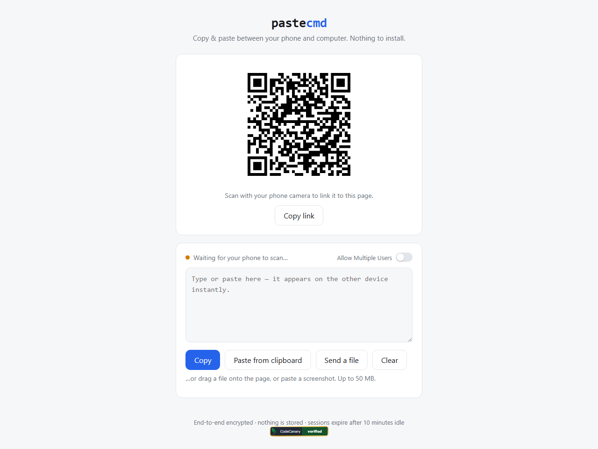
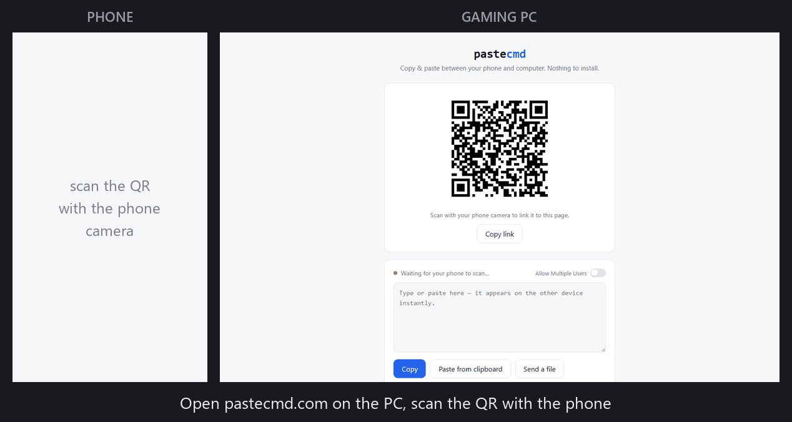

# pastecmd

Copy & paste between your phone and computer. No install, no account.

Open the site on your computer, scan the QR code with your phone, and anything
typed or pasted on one device appears on the other instantly. Files up to
50 MB (photos, PDFs, screenshots) can be sent too — drag one onto the page,
use the "Send a file" button, or paste a screenshot directly.

[](https://pastecmd.com)

Live at [pastecmd.com](https://pastecmd.com). Sibling project of
[passburn.com](https://github.com/HotStartLabs/passburn).



## How it works

- One Cloudflare Worker serves the static page and relays WebSocket messages
  through a Durable Object (one per session).
- The session key lives in the URL fragment (`#sessionId.key`), which browsers
  never send to the server. All clipboard content is AES-GCM encrypted in the
  browser, so the server only ever relays ciphertext.
- Files travel through the same relay, sliced into 256 KB chunks that are each
  encrypted and sent as binary WebSocket frames (Cloudflare caps a single
  message at 1 MB). Filenames are encrypted too. Nothing touches disk.

## Security model

- Sessions are capped at 2 concurrent devices by default; the host's "Allow
  Multiple Users" lever raises the cap to 8 (and regenerates the session, since
  the server locks the cap on the creator's first connection — later joiners
  can't widen it). A third device is turned away with a "session full" screen,
  which doubles as an alarm if someone else has captured the QR.
- Every ciphertext is bound to its context with AES-GCM AAD ("clip",
  "meta"+fileId, "chunk"+fileId+index), so the relay cannot replay a message
  as a different type or reorder file chunks without decryption failing.
- Server control messages (peer count) are NUL-prefixed and the relay refuses
  to forward client strings with that prefix — a device in the session cannot
  forge the peer count to hide its presence. The device counter in the UI is
  the intruder alarm: if it says 3 and you have 2 devices, start a new session.
- The WebSocket endpoint rejects browser connections from foreign origins.
- AES-256-GCM keys (post-quantum resistant by construction — pure symmetric
  crypto retains 128-bit margin against Grover).
- Strict security headers on every response: CSP (no inline script, no
  external sources) with Trusted Types enforcement (DOM-XSS sinks throw at
  runtime), HSTS (2 years, preload), full cross-origin isolation
  (COOP/COEP/CORP), X-Frame-Options DENY, no-referrer, nosniff.
- No cookies, no analytics, no external requests, no server-side storage of
  content — the only server state is a session-expiry alarm.
- Residual/accepted: anyone who captures the full QR/link during the session
  window holds the key (that's the trust model — guard the QR like a shared
  secret); Cloudflare sees connection metadata (IPs, timing, ciphertext sizes)
  but no plaintext; replay of an identical message within one session is
  possible but harmless (idempotent).
- Sessions expire after 10 minutes idle; nothing is ever stored.

## Local development

```
npm install
cp .dev.vars.example .dev.vars
npm run dev        # http://localhost:8787
```

To test, open the page, then open the "or open <link>" URL in a second
browser tab (or another device on your network) — the two will sync.

## Deploying

1. `npx wrangler login` — sign in to your (free) Cloudflare account.
2. `npm run deploy` — the site goes live on the custom domains in `routes`.

If you're deploying your own copy, edit `wrangler.jsonc` first:

- Set `CANONICAL_HOST` to your hostname. The worker redirects every other
  host to it, and it's the only origin allowed in the CSP `connect-src` and
  on the WebSocket relay.
- Replace the `routes` (they bind the worker to the pastecmd.com domains).
  To run on `workers.dev` instead, remove `routes`, set `"workers_dev": true`,
  and set `CANONICAL_HOST` to `pastecmd.<your-subdomain>.workers.dev`.

### Connecting the domains

1. In the Cloudflare dashboard, **Add a site** for `pastecmd.com` (free plan),
   then repeat for `pastecommand.com`. Cloudflare will show two nameservers
   for each.
2. At your domain registrar, replace each domain's nameservers with the ones
   Cloudflare gave you. (Propagation can take a few hours.)
3. In the dashboard under **Workers & Pages → pastecmd → Settings → Domains &
   Routes**, add custom domains: `pastecmd.com` and `pastecommand.com`.

The worker itself 301-redirects any `pastecommand.com` request to
`pastecmd.com`, so both names work and search engines see one canonical site.

## Costs

Free tier covers ~100K requests/day (thousands of sessions). If it outgrows
that, the $5/month Workers Paid plan covers ~10M requests.

## License

[MIT](LICENSE)
